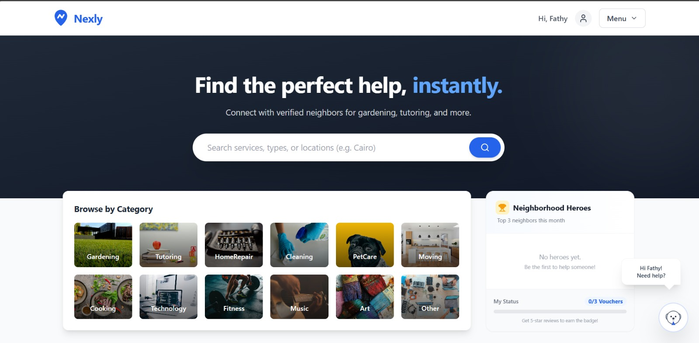
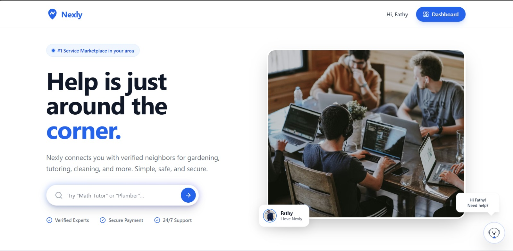
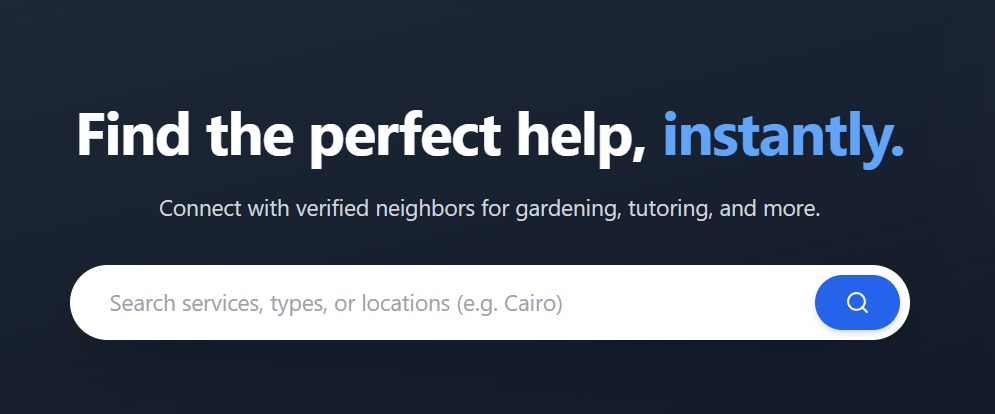

# Nexly - Neighborhood Skill Sharing Platform

> **"Help is just around the corner."**

Nexly is a modern full-stack hyper-local service marketplace. It connects community members with verified local experts for tasks like gardening, tutoring, cleaning, and repairs. Built with a focus on trust, the platform features real-time communication, secure payments, and AI-assisted discovery.

---

## Screenshots

**Provider Dashboard**

 

| Landing Page | Service Search |
|:---:|:---:|
|  |  |

*(Note: The app allows providers to list services and users to book them instantly.)*

---

## Key Features

### For Service Seekers
*   **AI Assistant ("Nexy"):** An integrated OpenAI chatbot that helps you find the right service or answers support questions instantly.
*   **Smart Search:** Filter services by category, location, and price.
*   **Real-Time Chat:** Built with SignalR, allowing seamless live messaging with providers before booking.
*   **Social Proof:** Read verified reviews and see ratings before hiring.

### For Service Providers
*   **Verified Badge System:** A verification workflow to build trust with neighbors.
*   **Provider Dashboard:** Manage bookings, earnings, and service listings in one place.
*   **Secure Payouts:** Integrated Stripe Connect for secure and fast payment processing.

---

## Technical Architecture

This project is built using Clean Architecture principles to ensure separation of concerns, scalability, and maintainability.

### The Tech Stack

| Layer | Technology |
| :--- | :--- |
| **Frontend** | React (Vite), TypeScript, Tailwind CSS, Framer Motion |
| **Backend** | ASP.NET Core Web API (.NET 9) |
| **Database** | SQL Server, Entity Framework Core (Code-First) |
| **Real-Time** | Azure SignalR Service / Native SignalR |
| **AI** | OpenAI GPT-4 Integration |
| **Cloud/Media**| Cloudinary (Image Optimization), Azure Blob Storage |
| **Auth** | JWT Authentication with Refresh Tokens |
| **Payments** | Stripe API |

---

### Prerequisites
*   .NET 9 SDK
*   Node.js & npm
*   SQL Server

---

Built with ❤️ by Fathy
